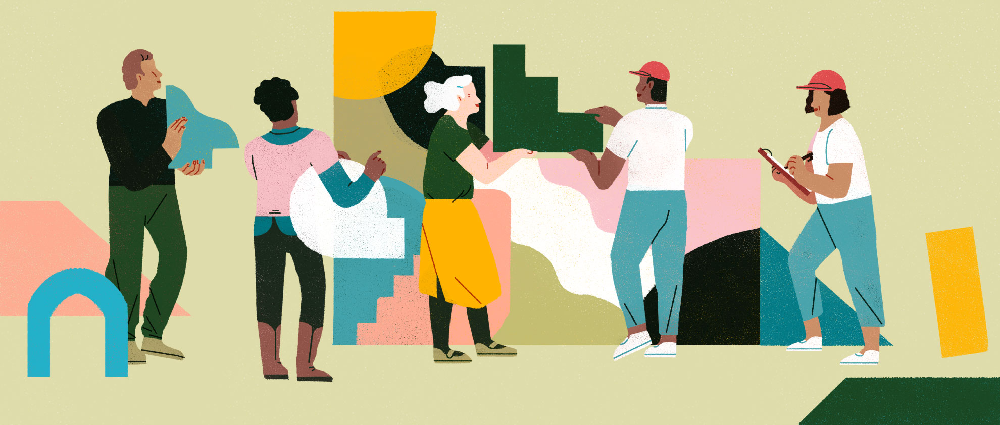

Much like the real world, the internet continues to complexify—it’s changed the way we think about design, and how we create solutions to address people’s evolving needs. We’ve shifted from simply designing interfaces that help people complete tasks (such as purchasing a book online), to helping people tell stories, provide services, and offer feedback—all while having an understanding of and empathy for their audience. We’ve moved from the user having a task, to the user having a user.

As a Design Lead on the Host Success team, I think a lot about building tools that help communities connect and empathize with one another. Our team is designing for both online and offline moments, check-in being a big one. It’s a moment loaded with firsts—first in-person interaction between guests and hosts, first time experiencing Airbnb in the physical world, and the first rung in the trust ladder with Airbnb.

Having observed a series of behaviors, interactions, and workarounds between hosts and guests, our team realized there was an opportunity to make this moment more seamless and predictable. We kicked off a yearlong project to design a global check-in tool that could do just that.

Illuminating Observation
The decision to design the tool was informed by an intriguing host behavior. We noticed that about 1.5 million photo messages were being sent from host to guest each week—the majority of them to explain location and entry details. Photos of the home were juxtaposed with maps, lockbox locations were described, and landmarks were called out.