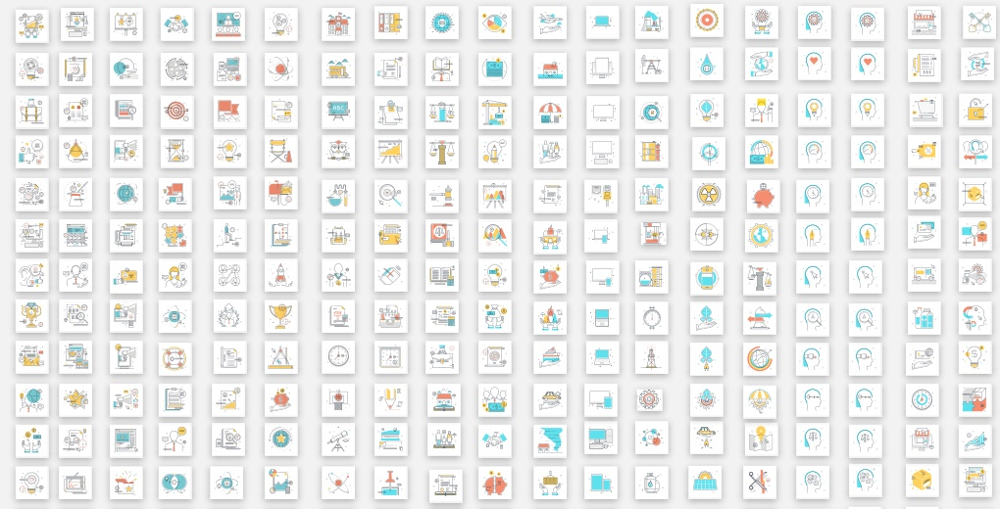
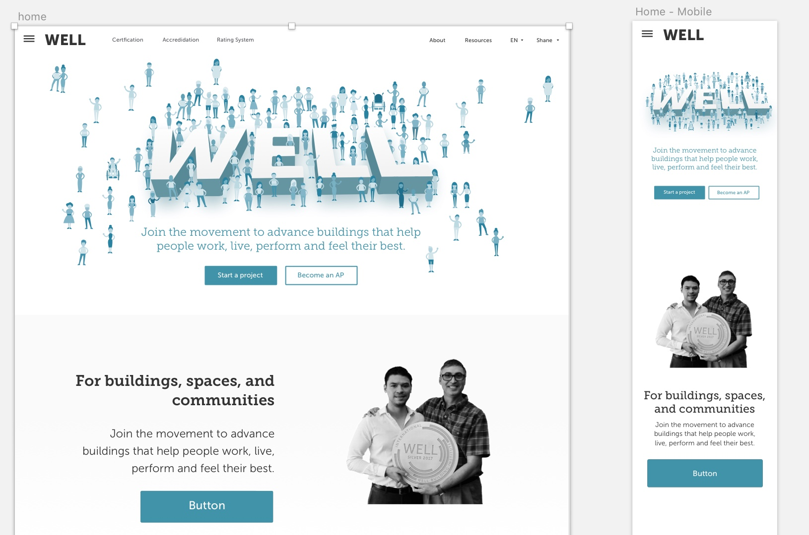
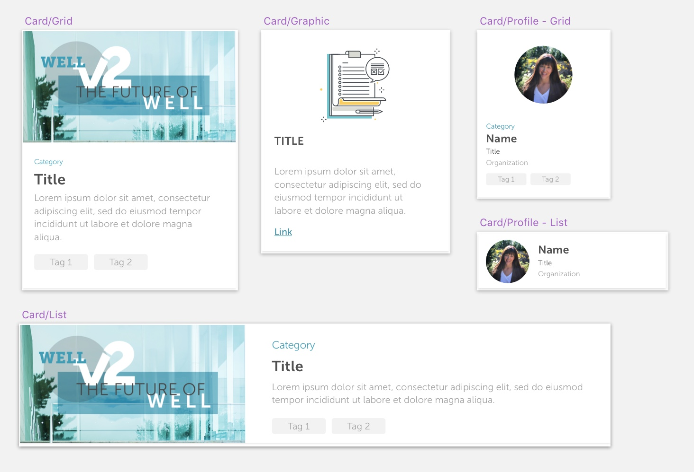

Some of the new illustration and icon options available to WELL v2 pages

Working in software development and design, often requires developers to ship one-off solutions. Sometimes we’re working within time constraints and sometimes we just haven’t yet agreed upon a path forward. These one-off solutions aren’t inherently bad, but if they aren’t built upon a solid foundation, we eventually find ourselves having to pay back accrued technical and design debts. 

Simply put, you can’t innovate on products without first innovating the way you build them. 

This idea has informed industrial design and architecture for decades, and the design and development team at International WELL Building Institute wanted to translate that insight into a better way to construct our WELL digital experience. 

**Systems as strategy**
Visual language is like any other language. Misunderstandings arise if the language is not shared and understood by everyone using it. As a product or team grows, the challenges within these modalities compound.

Design has always been largely about systems, and how to create products in a scalable and repeatable way. From IKEA instructions to Pantone colors, these systems enable people to manage the chaos and create better products.

A unified design system is essential to building better and faster; better because a cohesive experience is more easily understood by our users, and faster because it gives us a common language to work with.

Landing page iterations for both the desktop and mobile WELL experience.

**Beyond the style guide**
This exploration led us to the development of Blue, IWBI’s new Design Language System (or DLS). Blue is a collection of components defined by shared principles and patterns. This allows for rapid iteration using a shared vocabulary across design, engineering, and other disciplines.

It focuses on common ingredients that follow our core design principles: consistent, common, creative, and conversational. 

* Consistent: Each piece is part of a greater whole and should contribute positively to the system at scale. There should be no isolated features or outliers.

* Common: WELL is used around the world by a wide global community. Our products and visual language should be approachable and translatable to any community.

* Creative: In both design and functionality, our work should speak boldly, illicit delight, and encourage users to want more engagement. 

* Conversational: We want our digital experiences to evoke human qualities, and encourage allows us to communicate with users in easily understood ways.

Typically, style guides define components as atomic components, which are then used to build more complex molecules. In theory, this works well to create coherent and flexible systems. In practice, however, what often happens is that these re-usable atoms are used many different ways, allowing all kinds of molecules to be created. Again, this opens the door for all kinds of disjointed experiences and makes the system harder to maintain.

Instead of relying on individual atoms, we started considering our components as elements of a living organism. They have a function and personality, are defined by a set of properties, can co-exists with others and can evolve independently. A unified design language should not just be a set of static rules and individual atoms, but an evolving ecosystem.

For example, our “content card” element might be initially defined by a style guide, but its end use in the platform can take on hundreds of permutations, making it difficult to successfully update the content card element down the road.” If we want to change either of these things, we can be sure that we don’t break other screens.

The display options for content across the WELL system

Each component is defined by it’s required elements (such as title, text, icon and picture), and may sometimes contain optional elements. These elements are both defined in the Sketch document as well as in code. 

All of the components and views are built with our own technical view framework, which handles these styles, states and adaptivity

**Democratizing our design**
Our design team is tasked with creating an environment built on top of the foundation of Blue, such as integration with third-party tools, like Adobe Photoshop and Bohemian Coding’s Sketch. This will allow teammates to quickly access all components and even real data from within the tools they use daily. 

The biggest existential threat to any system is neglect. The attrition generated by how difficult it is to use and maintain a cohesive system across various teams with their own specific needs. Therefore, plan to more fully integrate lay staff at IWBI into the development process and equip everyone with the ability to contribute to multi-voice, multidisciplinary digital WELL experience. 

Additionally, we aim to be fully transparent and release detailed case studies on how our system is defined and what decisions go into designing components, patterns, and rules. We want to build a world where the differences between disciplines are blurred, where logic and design truly coexist, and where collaboration is not painful but inspiring.

**For the future we want**
Blue provides us with a shared understanding of our visual style, and streamlines contributions to a single system. This system also enables all of us to prototype and experiment with ideas in high fidelity faster and at a lower cost.

While this was a monumental task that ended up requiring efforts from many of our product engineers, we’re confident that creating Blue will be worth the investment and a huge leap forward for the organization. By focusing on the methods of working across disciplines, building better tools, and creating a unified system, we can use our time to apply creativity to solve bigger challenges and build the future we all want. 

